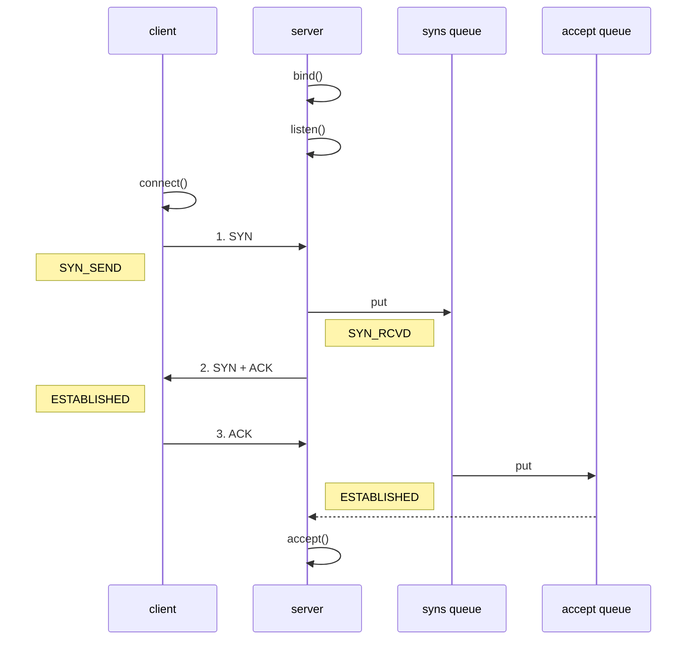

# Netty的优化和源码

## netty 参数优化

对于客户端和服务端，两者存在参数配置上的不同点。

* 客户端：通过 `BootStrap#option`配置，配置的是 SocketChannel 的参数
* 服务端：通过`ServerBootStrap#option`或`ServerBootStrap#childOption`配置，前者配置的是 SocketChannel 的参数，后者配置的是 ServerSocketChannel 的参数

### CONNECT_TIMEOUT_MILLIS 连接超时参数

* 属于 socketchannel 参数
* 客户端建立连接时，如果在指定毫秒内无法连接，就会抛出异常
* SO_TIMEOUT 主要用在阻塞 IO 中，阻塞 IO 中accept，read 等都是无限等待的，如果不希望永远阻塞，使用它调整时间

```java
@Slf4j
public class TestConnectionTimeOut {

   public static void main(String[] args) {
      NioEventLoopGroup group = new NioEventLoopGroup();
      try {
         Bootstrap boot = new Bootstrap();
         ChannelFuture future = boot.group(group)
               .channel(NioSocketChannel.class)
               .option(ChannelOption.CONNECT_TIMEOUT_MILLIS, 5000)
               .handler(new LoggingHandler())
               .connect("localhost", 8080);
         future.sync().channel().closeFuture().sync();
      } catch (Exception e) {
         e.printStackTrace();
         log.debug("timeout");
      } finally {
         group.shutdownGracefully();
      }
   }
}
```


### SO_BACKLOG

* 属于 ServerSocketChannel 的参数



首先根据上图分析tcp 的三次握手：

1. 首先 server 和 client 都需要初始化自身的相关配置
2. client 发起第一次握手，发送 syn 包，server 接收到后，会将当前的连接信息存放到「半连接队列中」
3. server 紧接着向 client 发送响应包
4. client 接收到响应后，也会发送一个响应包，server 接收到响应后，会将当前连接信息从「半连接队列」移动到「全连接队列」，在空闲时间（或者说可以建立连接）时，调用 accept 方法，此时才算连接建立成功。

> 要注意的是，三次握手过程中，并不是握手完毕就代表连接建立成功，其实还需要将连接信息从「全连接队列」中取出来，进行 accept 操作，只有完成上次操作才会保证连接建立成功。

综上所述，可以看出来：

1. 「半连接队列」作用是将**能够发送**连接请求的连接信息缓存下来，不放到「全连接」中是因为预防出现 syn 攻击的情况。
2. 「全连接队列」作用是将**能够建立连接**的连接信息在高负载下缓存起来，以保证能够在之后其他连接请求处理完毕后，处理「全连接队列」。例如 netty 能够处理 1000 个连接请求，那么1000 个请求进入服务端，都是能够处理的，但是处理过程中又来了 100 个，这时才会把这些存放到「全连接队列」中。

#### ulimit -n

* 属于操作系统参数

#### TCP_NODELAY

* 属于 SocketChannal 参数
* 对 nagle 算法的设置

#### SO_SNDBUF & SO_RCVBUF

* SO_SNDBUF 属于 SocketChannal 参数
* SO_RCVBUF 既可用于 SocketChannal 参数，也可以用于 ServerSocketChannal 参数（建议设置到 ServerSocketChannal 上）

#### ⭐️ALLOCATOR

* 属于 SocketChannal 参数

* 用来分配 ByteBuf，调用``ctx.alloc()``方法时候，就是使用的 ALLOCATOR 参数

* 通过源码分析，可以看出 ALLOCATOR 参数究竟是怎么产生作用的。 
  
    由接口`` ChannelConfig`` 作为入口，具体的实现类是 `DefaultChannelConfig`。
    
    `DefaultChannelConfig`的 allocator 属性就是分配 ByteBuf 的工具。一直追踪可以找到`ByteBufUtil#DEFAULT_ALLOCATOR`属性，这个是根本上的分配 ByteBuf 的工具类。
    
    ```java
    ChannelConfig->DefaultChannelConfig{
        private volatile ByteBufAllocator allocator = ByteBufAllocator.DEFAULT;
    }
    ByteBufAllcator {
        ByteBufAllocator DEFAULT = ByteBufUtil.DEFAULT_ALLOCATOR;
    }
    ByteBufUtil{
        static final ByteBufAllocator DEFAULT_ALLOCATOR;
        static {
            String allocType = SystemPropertyUtil.get(
                    "io.netty.allocator.type", PlatformDependent.isAndroid() ? "unpooled" : "pooled");
            allocType = allocType.toLowerCase(Locale.US).trim();
    
            ByteBufAllocator alloc;
            if ("unpooled".equals(allocType)) {
                alloc = UnpooledByteBufAllocator.DEFAULT;
                logger.debug("-Dio.netty.allocator.type: {}", allocType);
            } else if ("pooled".equals(allocType)) {
                alloc = PooledByteBufAllocator.DEFAULT;
                logger.debug("-Dio.netty.allocator.type: {}", allocType);
            } else {
                alloc = PooledByteBufAllocator.DEFAULT;
                logger.debug("-Dio.netty.allocator.type: pooled (unknown: {})", allocType);
            }
    
            DEFAULT_ALLOCATOR = alloc;
        }
    }
    ```
    
    根据代码可以看出来，DEFAULT_ALLOCATOR 的初始化在 static 代码块中
    
    首先根据 vm 系统配置查看 ByteBuf 分配类型 allocType（池化还是非池化）
    
    根据 allocType 选择对应的真正的 allocator。进入到真正的创建 allocator 对象，如下面所示。
    
    `public static final UnpooledByteBufAllocator DEFAULT = new UnpooledByteBufAllocator(PlatformDependent.directBufferPreferred());`
    
    这时候已经确定了是否池化，但是没有确定分配空间（直接内存还是堆内存），需要根据`PlatformDependent.directBufferPreferred()`返回值判断。最后发现还是需要判断 vm 配置决定是直接内存还是堆内存。
    
    > 综上所述，ByteBuf 的分配是由`io.netty.allocator.type`和`io.netty.noPreferDirect`两个配置决定的，默认分配为池化直接内存。
    >
    > 当然，由于 ALLOCATOR 也可以作为server 的 `childOption` 参数，所以我们完全可以通过 `childOption`方法确定 allocator。比如：`childOption(ChannelOption.ALLOCATOR, new UnpooledByteBufAllocator(false))` 创建一个非池化堆内存分配的 allocator。

#### ⭐️RCVBUF_ALLOCATOR

* 属于 SocketChannal 参数
* 控制 netty 接收缓冲区大小
* 负责入站数据的分配，决定入站缓冲区的大小（并可动态调整），统一采用 direct 直接内存，具体池化还是非池化由 allocator 决定

通过debug 可以查看 RECVBUF_ALLOCATOR 参数代码的调用情况。直接跳转到 `AbstractNioByteChannel.NioByteUnsafe#read`方法

```java
void read() {
    // ByteBuf 的分配器，负责池化还是非池化，直接内存还是非直接内存
    final ByteBufAllocator allocator = config.getAllocator(); 
    // allocHandle 是 RecvByteBufAllocator 的内部类
    final RecvByteBufAllocator.Handle allocHandle = recvBufAllocHandle(); 
    allocHandle.reset(config);
	
    ByteBuf byteBuf = null;
    byteBuf = allocHandle.allocate(allocator);
    // 省略其他代码
}
```

由代码可以看出，ByteBuf 的创建是由`RecvByteBufAllocator`的内部类`Handle`调用`allocate`方法创建的。

首先关注 allocator，进入方法查看。此时返回的 allocator 就是在option中确定 ALLOCATOR 时创建的，此时的 allocator 直接内存或者堆内存、池化或者非池化都是可选的。

```java
DefaultChannelCongfig#getAllocator
public ByteBufAllocator getAllocator() {
        return allocator;
    }
```

然后我们进入到下一个方法中。

```java
	AbstractChannel#recvBufAllocHandle
	public RecvByteBufAllocator.Handle recvBufAllocHandle() {
            if (recvHandle == null) {
                recvHandle = config().getRecvByteBufAllocator().newHandle();
            }
            return recvHandle;
        }

	DefaultChannelConfig#getRecvByteBufAllocator
	@Override
    public <T extends RecvByteBufAllocator> T getRecvByteBufAllocator() {
        return (T) rcvBufAllocator;
    }
	
	AdaptiveRecvByteBufAllocator#newHandle
	@Override
    public Handle newHandle() {
        return new HandleImpl(minIndex, maxIndex, initial);
    }
```

这个方法就是用来创建handle 的，这个 handle 用于分配 ByteBuf 的大小。

最后进入 allocate 方法

```java
DefaultMaxMessagesRecvByteBufAllocator.MaxMessageHandle#allocate
public ByteBuf allocate(ByteBufAllocator alloc) {
     return alloc.ioBuffer(guess()); 
}

	AbstractByteBufAllocator#ioBuffer(int)
    public ByteBuf ioBuffer(int initialCapacity) {
        // 只有当 unsafe 类能够被找到（能够使用直接内存），或者是直接池化内存，才能分配一个相关的 ByteBuf。通常能够使用直接内存。
        if (PlatformDependent.hasUnsafe() || isDirectBufferPooled()) { 
            return directBuffer(initialCapacity);
        }
        return heapBuffer(initialCapacity);
    }
```

首先通过 guess 方法选择一个 ByteBuf 的初始大小，由于是 IOBuffer，所以生成的 ByteBuf 都是直接内存的，反应到代码上就是ioBuffer方法。

### rpc构建


## 源码分析

### 启动分析

首先走一遍仅仅使用 NIO 启动一个服务端的过程

```java
// 创建 selector，在 netty 中存在于 NioEventLoopGroup 封装线程和 selector
Selector selector = Selector.open();

// 创建 Netty 层面的 Channel，同时初始化相关联的 Channel 以及为原生的 ssc 存储 config
NioServerSocketChannel attachment = new NioServerSocketChannel();

// 创建 NioServerSocketChannel 时，创建了 java 原生的 ServerSocketChannel
ServerSocketChannel serverSocketChannel = ServerSocketChannel.open();
serverSocketChannel.configureBlocking(false);

// 启动 nio boss 线程执行接下来操作
// 注册，仅关联 selector 和 NioServerSocketChannel，未关注事件
serverSocketChannel.register(selector, 0, attachment);

// head -> 初始化器 -> ServerBootstrapAcceptor -> tail， 初始化器只是一次性的，只为了添加 acceptor
// bind 端口
serverSocketChannel.bind(new InetSocketAddress(8080));
// 触发 channel active 事件，在 head 中关注 op_accept事件
selectionKey.interestOps(SelectionKey.OP_ACCEPT);
```

